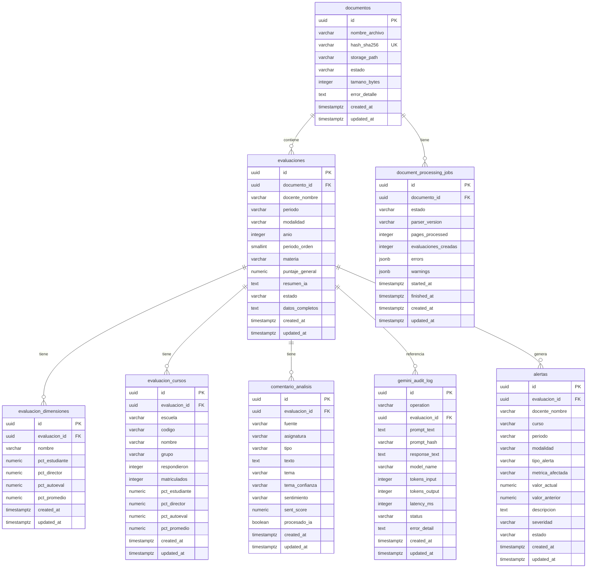

# Modelo de Datos

> Esquema relacional, tipos, índices y política de migraciones.
> Última actualización: 2026-06-04

---

## Diagrama Entidad-Relación



        text error_detail
        timestamptz created_at
        timestamptz updated_at
    }

````

---

## Tablas en Detalle

### `documentos`

Representa un archivo PDF subido al sistema.

| Columna          | Tipo            | Restricciones                | Descripción                                   |
| ---------------- | --------------- | ---------------------------- | --------------------------------------------- |
| `id`             | `UUID`          | PK, default `uuid4`          | Identificador único                           |
| `nombre_archivo` | `VARCHAR(500)`  | NOT NULL                     | Nombre original del PDF                       |
| `hash_sha256`    | `VARCHAR(64)`   | UNIQUE, NOT NULL, INDEX      | Hash para deduplicación                       |
| `storage_path`   | `VARCHAR(1000)` | NOT NULL                     | Ruta en MinIO                                 |
| `estado`         | `VARCHAR(20)`   | NOT NULL, default `'subido'` | `subido`, `procesando`, `completado`, `error` |
| `tamano_bytes`   | `INTEGER`       | NULL                         | Tamaño del archivo                            |
| `error_detalle`  | `TEXT`          | NULL                         | Mensaje de error si el procesamiento falló    |
| `created_at`     | `TIMESTAMPTZ`   | NOT NULL, default `now()`    | Fecha de creación                             |
| `updated_at`     | `TIMESTAMPTZ`   | NOT NULL, default `now()`    | Última modificación                           |

**Índices:** `ix_documentos_hash_sha256` (UNIQUE)

---

### `evaluaciones`

Datos estructurados extraídos de un PDF procesado.

| Columna           | Tipo           | Restricciones                          | Descripción                                             |
| ----------------- | -------------- | -------------------------------------- | ------------------------------------------------------- |
| `id`              | `UUID`         | PK                                     | Identificador único                                     |
| `documento_id`    | `UUID`         | FK → `documentos.id` ON DELETE CASCADE | PDF fuente                                              |
| `docente_nombre`  | `VARCHAR(300)` | NOT NULL, INDEX                        | Nombre del docente evaluado                             |
| `periodo`         | `VARCHAR(50)`  | NOT NULL, INDEX                        | Periodo académico (ej: `"I Cuatrimestre 2025"`)         |
| `modalidad`       | `VARCHAR(20)`  | NOT NULL, default `'DESCONOCIDA'`, INDEX | Modalidad: `CUATRIMESTRAL`, `MENSUAL`, `B2B`, `DESCONOCIDA` |
| `año`             | `SMALLINT`     | NOT NULL, CHECK >= 2020                | Año académico extraído del período                        |
| `periodo_orden`   | `SMALLINT`     | NOT NULL                               | Orden del período dentro del año [BR-AN-40]             |
| `materia`         | `VARCHAR(300)` | NULL                                   | Materia principal (si se identifica)                    |
| `puntaje_general` | `NUMERIC(5,2)` | NULL, CHECK 0-100                      | Porcentaje promedio general                             |
| `resumen_ia`      | `TEXT`         | NULL                                   | Resumen generado por Gemini                             |
| `estado`          | `VARCHAR(20)`  | NOT NULL, default `'pendiente'`, INDEX | `pendiente`, `completado`, `error`                      |
| `datos_completos` | `TEXT`         | NULL                                   | JSON con datos completos del parseo                     |
| `created_at`      | `TIMESTAMPTZ`  | NOT NULL                               | Fecha de creación                                       |
| `updated_at`      | `TIMESTAMPTZ`  | NOT NULL                               | Última modificación                                     |

**Índices:** `ix_evaluaciones_documento_id`, `ix_evaluaciones_docente_nombre`, `ix_evaluaciones_periodo`, `ix_evaluaciones_modalidad`, `ix_evaluaciones_estado`, `ix_evaluaciones_modalidad_periodo` (compuesto), `ix_evaluaciones_modalidad_anio_periodo_orden` (compuesto)

---

### `evaluacion_dimensiones`

Puntajes por dimensión pedagógica (ej: METODOLOGÍA, Dominio, CUMPLIMIENTO).

| Columna          | Tipo           | Restricciones                            | Descripción                       |
| ---------------- | -------------- | ---------------------------------------- | --------------------------------- |
| `id`             | `UUID`         | PK                                       | Identificador único               |
| `evaluacion_id`  | `UUID`         | FK → `evaluaciones.id` ON DELETE CASCADE | Evaluación padre                  |
| `nombre`         | `VARCHAR(100)` | NOT NULL, INDEX                          | Nombre de la dimensión            |
| `pct_estudiante` | `NUMERIC(5,2)` | NULL                                     | Porcentaje evaluación estudiantes |
| `pct_director`   | `NUMERIC(5,2)` | NULL                                     | Porcentaje evaluación director    |
| `pct_autoeval`   | `NUMERIC(5,2)` | NULL                                     | Porcentaje autoevaluación         |
| `pct_promedio`   | `NUMERIC(5,2)` | NULL                                     | Promedio de las tres fuentes      |
| `created_at`     | `TIMESTAMPTZ`  | NOT NULL                                 | Fecha de creación                 |
| `updated_at`     | `TIMESTAMPTZ`  | NOT NULL                                 | Última modificación               |

**Índices:** `ix_eval_dim_evaluacion`, `ix_eval_dim_nombre`

**Restricción UNIQUE:** `(evaluacion_id, nombre)` — impide duplicar dimensiones dentro de una evaluación.

---

### `evaluacion_cursos`

Una fila por curso-grupo evaluado dentro de cada evaluación.

| Columna          | Tipo           | Restricciones                            | Descripción                            |
| ---------------- | -------------- | ---------------------------------------- | -------------------------------------- |
| `id`             | `UUID`         | PK                                       | Identificador único                    |
| `evaluacion_id`  | `UUID`         | FK → `evaluaciones.id` ON DELETE CASCADE | Evaluación padre                       |
| `escuela`        | `VARCHAR(200)` | NULL                                     | Escuela (ej: `"ESC ING DEL SOFTWARE"`) |
| `codigo`         | `VARCHAR(50)`  | NULL                                     | Código de asignatura (ej: `"INF-02"`)  |
| `nombre`         | `VARCHAR(300)` | NULL                                     | Nombre de la asignatura                |
| `grupo`          | `VARCHAR(50)`  | NULL                                     | Grupo del curso                        |
| `respondieron`   | `INTEGER`      | NULL                                     | Estudiantes que respondieron           |
| `matriculados`   | `INTEGER`      | NULL                                     | Total de matriculados                  |
| `pct_estudiante` | `NUMERIC(5,2)` | NULL                                     | Porcentaje eval. estudiantes           |
| `pct_director`   | `NUMERIC(5,2)` | NULL                                     | Porcentaje eval. director              |
| `pct_autoeval`   | `NUMERIC(5,2)` | NULL                                     | Porcentaje autoevaluación              |
| `pct_promedio`   | `NUMERIC(5,2)` | NULL                                     | Promedio de las tres fuentes           |
| `created_at`     | `TIMESTAMPTZ`  | NOT NULL                                 | Fecha de creación                      |
| `updated_at`     | `TIMESTAMPTZ`  | NOT NULL                                 | Última modificación                    |

**Índices:** `ix_eval_curso_evaluacion`

**Restricción UNIQUE:** `(evaluacion_id, codigo, grupo)` — impide duplicar cursos por código+grupo dentro de una evaluación.

---

### `comentario_analisis`

Un registro por comentario cualitativo clasificado.

| Columna          | Tipo           | Restricciones                            | Descripción                                       |
| ---------------- | -------------- | ---------------------------------------- | ------------------------------------------------- |
| `id`             | `UUID`         | PK                                       | Identificador único                               |
| `evaluacion_id`  | `UUID`         | FK → `evaluaciones.id` ON DELETE CASCADE | Evaluación padre                                  |
| `fuente`         | `VARCHAR(20)`  | NOT NULL                                 | `"Estudiante"` o `"Director"`                     |
| `asignatura`     | `VARCHAR(300)` | NOT NULL                                 | Nombre de la asignatura                           |
| `tipo`           | `VARCHAR(20)`  | NOT NULL, INDEX                          | `"fortaleza"`, `"mejora"`, `"observacion"`        |
| `texto`          | `TEXT`         | NOT NULL                                 | Texto del comentario                              |
| `tema`           | `VARCHAR(50)`  | NOT NULL, INDEX                          | Tema clasificado (ej: `"metodologia"`)            |
| `tema_confianza` | `VARCHAR(10)`  | NOT NULL, default `'regla'`              | `"regla"` (keywords) o `"ia"` (Gemini)            |
| `sentimiento`    | `VARCHAR(10)`  | NULL, INDEX                              | `"positivo"`, `"negativo"`, `"neutro"`, `"mixto"` |
| `sent_score`     | `NUMERIC(3,2)` | NULL                                     | Score de -1.0 a 1.0                               |
| `procesado_ia`   | `BOOLEAN`      | NOT NULL, default `false`                | Si fue clasificado por Gemini                     |
| `created_at`     | `TIMESTAMPTZ`  | NOT NULL                                 | Fecha de creación                                 |
| `updated_at`     | `TIMESTAMPTZ`  | NOT NULL                                 | Última modificación                               |

**Índices:** `ix_comentario_evaluacion`, `ix_comentario_tipo`, `ix_comentario_tema`, `ix_comentario_sentimiento`

**Temas válidos:** `metodologia`, `dominio_tema`, `comunicacion`, `evaluacion`, `puntualidad`, `material`, `actitud`, `tecnologia`, `organizacion`, `otro`

---

### `gemini_audit_log`

Registro de auditoría de cada llamada a la API de Gemini.

| Columna         | Tipo          | Restricciones                             | Descripción                                   |
| --------------- | ------------- | ----------------------------------------- | --------------------------------------------- |
| `id`            | `UUID`        | PK                                        | Identificador único                           |
| `operation`     | `VARCHAR(30)` | NOT NULL, INDEX                           | Tipo de operación (ej: `"query"`)             |
| `evaluacion_id` | `UUID`        | FK → `evaluaciones.id` ON DELETE SET NULL | Evaluación relacionada (opcional)             |
| `prompt_text`   | `TEXT`        | NOT NULL                                  | Prompt completo enviado                       |
| `prompt_hash`   | `VARCHAR(64)` | NOT NULL, INDEX                           | SHA-256 del prompt (para detectar duplicados) |
| `response_text` | `TEXT`        | NULL                                      | Respuesta del modelo                          |
| `model_name`    | `VARCHAR(50)` | NOT NULL                                  | Modelo usado (ej: `"gemini-2.5-flash"`)       |
| `tokens_input`  | `INTEGER`     | NULL                                      | Tokens de entrada                             |
| `tokens_output` | `INTEGER`     | NULL                                      | Tokens de salida                              |
| `latency_ms`    | `INTEGER`     | NULL                                      | Latencia en milisegundos                      |
| `status`        | `VARCHAR(10)` | NOT NULL, default `'ok'`                  | `"ok"` o `"error"`                            |
| `error_detail`  | `TEXT`        | NULL                                      | Detalle del error si `status = 'error'`       |
| `created_at`    | `TIMESTAMPTZ` | NOT NULL                                  | Fecha de creación                             |
| `updated_at`    | `TIMESTAMPTZ` | NOT NULL                                  | Última modificación                           |

**Índices:** `ix_audit_operation`, `ix_audit_prompt_hash`

---

### `alertas`

Alertas generadas automáticamente por el motor de reglas de negocio [AL-10 a AL-50].

| Columna            | Tipo           | Restricciones                                | Descripción                                                  |
| ------------------ | -------------- | -------------------------------------------- | ------------------------------------------------------------ |
| `id`               | `UUID`         | PK                                           | Identificador único                                          |
| `evaluacion_id`    | `UUID`         | FK → `evaluaciones.id` ON DELETE SET NULL    | Evaluación que generó la alerta                              |
| `docente_nombre`   | `VARCHAR(300)` | NOT NULL, INDEX                              | Nombre del docente                                           |
| `curso`            | `VARCHAR(400)` | NOT NULL                                     | Nombre del curso-grupo                                       |
| `periodo`          | `VARCHAR(50)`  | NOT NULL                                     | Período académico                                            |
| `modalidad`        | `VARCHAR(20)`  | NOT NULL, INDEX                              | `CUATRIMESTRAL`, `MENSUAL`, `B2B`                            |
| `tipo_alerta`      | `VARCHAR(30)`  | NOT NULL, CHECK                              | `BAJO_DESEMPEÑO`, `CAIDA`, `SENTIMIENTO`, `PATRON`          |
| `metrica_afectada` | `VARCHAR(50)`  | NOT NULL                                     | Métrica que disparó la alerta                                |
| `valor_actual`     | `NUMERIC(7,2)` | NOT NULL                                     | Valor actual de la métrica                                   |
| `valor_anterior`   | `NUMERIC(7,2)` | NULL                                         | Valor anterior (para alertas de caída)                       |
| `descripcion`      | `TEXT`         | NOT NULL                                     | Descripción legible de la alerta                             |
| `severidad`        | `VARCHAR(10)`  | NOT NULL, CHECK                              | `alta`, `media`, `baja`                                      |
| `estado`           | `VARCHAR(15)`  | NOT NULL, default `'activa'`, INDEX          | `activa`, `revisada`, `resuelta`, `descartada`               |
| `created_at`       | `TIMESTAMPTZ`  | NOT NULL                                     | Fecha de creación                                            |
| `updated_at`       | `TIMESTAMPTZ`  | NOT NULL                                     | Última modificación                                          |

**Índices:** `ix_alertas_modalidad`, `ix_alertas_severidad`, `ix_alertas_estado`, `ix_alertas_modalidad_estado` (compuesto), `ix_alertas_docente`

**Restricción UNIQUE:** `(docente_nombre, curso, periodo, tipo_alerta, modalidad)` — deduplicación de alertas [AL-40]. Incluye `modalidad` para permitir alertas independientes por modalidad.

**Restricción UNIQUE:** `(docente_nombre, curso, periodo, tipo_alerta)` — deduplicación [AL-40]

**Tipos de alerta:**

| Tipo               | Descripción                                          | Severidad |
| ------------------ | ---------------------------------------------------- | --------- |
| `BAJO_DESEMPEÑO`   | Puntaje promedio < umbral (60%)                      | alta      |
| `CAIDA`            | Caída significativa respecto al período anterior      | media     |
| `SENTIMIENTO`      | Alto porcentaje de comentarios negativos              | media     |
| `PATRON`           | Patrón recurrente detectado en múltiples períodos    | baja      |

---

### `document_processing_jobs`

Registro de trabajos de procesamiento de PDFs. Trazabilidad del pipeline.

| Columna                | Tipo          | Restricciones                                | Descripción                              |
| ---------------------- | ------------- | -------------------------------------------- | ---------------------------------------- |
| `id`                   | `UUID`        | PK                                           | Identificador único                      |
| `documento_id`         | `UUID`        | FK → `documentos.id` ON DELETE CASCADE, INDEX | Documento procesado                     |
| `estado`               | `VARCHAR(20)` | NOT NULL, default `'pendiente'`, INDEX, CHECK | `pendiente`, `procesando`, `completado`, `error` |
| `parser_version`       | `VARCHAR(20)` | NOT NULL                                     | Versión del parser usado                 |
| `pages_processed`      | `INTEGER`     | NULL                                         | Páginas procesadas                       |
| `evaluaciones_creadas` | `INTEGER`     | NOT NULL, default `0`                        | Evaluaciones creadas en este job         |
| `errors`               | `JSONB`       | NULL                                         | Errores encontrados                      |
| `warnings`             | `JSONB`       | NULL                                         | Warnings del parseo                      |
| `started_at`           | `TIMESTAMPTZ` | NULL                                         | Inicio del procesamiento                 |
| `finished_at`          | `TIMESTAMPTZ` | NULL                                         | Fin del procesamiento                    |
| `created_at`           | `TIMESTAMPTZ` | NOT NULL                                     | Fecha de creación                        |
| `updated_at`           | `TIMESTAMPTZ` | NOT NULL                                     | Última modificación                      |

---

## Extensiones de PostgreSQL

```sql
CREATE EXTENSION IF NOT EXISTS vector;     -- pgvector para búsqueda semántica
CREATE EXTENSION IF NOT EXISTS "uuid-ossp"; -- Generación de UUIDs
````

Estas extensiones se crean en `infra/docker/postgres/init.sql` al inicializar el contenedor.

---

## Patrones de Diseño

### Mixins comunes

Todas las entidades heredan de `UUIDMixin` (PK UUID auto-generado) y `TimestampMixin` (`created_at`, `updated_at` con trigger `now()`).

```python
class UUIDMixin:
    id: Mapped[uuid.UUID] = mapped_column(Uuid, primary_key=True, default=uuid.uuid4)

class TimestampMixin:
    created_at: Mapped[datetime] = mapped_column(DateTime(timezone=True), server_default=func.now())
    updated_at: Mapped[datetime] = mapped_column(DateTime(timezone=True), server_default=func.now(), onupdate=func.now())
```

### ON DELETE CASCADE

Todas las FK hijas usan `ON DELETE CASCADE` excepto `gemini_audit_log.evaluacion_id` que usa `ON DELETE SET NULL` (los logs de auditoría deben sobrevivir a la eliminación de evaluaciones).

### Deduplicación

`documentos.hash_sha256` (UNIQUE) previene la carga duplicada del mismo PDF.

---

## Historial de Migraciones

| Revisión | Fecha      | Descripción                                                      |
| -------- | ---------- | ---------------------------------------------------------------- |
| `0001`   | 2026-04-03 | Schema inicial: `documentos` y `evaluaciones`                    |
| `0002`   | 2026-04-03 | Agrega `datos_completos` (TEXT) a `evaluaciones`                 |
| `0003`   | 2026-04-03 | Agrega `evaluacion_dimensiones` y `evaluacion_cursos`            |
| `0004`   | 2026-04-03 | Agrega `comentario_analisis` con clasificación                   |
| `0005`   | 2026-04-04 | Agrega `gemini_audit_log` para auditoría de IA                   |
| `0006`   | 2026-04-04 | Agrega índices de rendimiento para analytics y qualitative       |
| `0007`   | 2026-04-04 | Agrega `modalidad`, `año`, `periodo_orden` a `evaluaciones`      |
| `0008`   | 2026-04-04 | Crea tabla `alertas` (sistema de alertas [AL-10] a [AL-50])      |
| `0009`   | 2026-04-04 | Crea `document_processing_jobs` + restricciones UNIQUE           |
| `0010`   | 2026-04-08 | Agrega CHECK constraint en `sent_score` de `comentario_analisis` |
| `0011`   | 2026-04-08 | Agrega `modalidad` a restricción UNIQUE de `alertas` (dedup)     |

### Comandos de migración

```bash
# Aplicar todas las migraciones pendientes
make migrate

# Crear nueva migración (autogenerate)
make migration

# Manualmente con Alembic
cd backend
alembic -c app/infrastructure/database/migrations/alembic.ini upgrade head
alembic -c app/infrastructure/database/migrations/alembic.ini revision --autogenerate -m "descripcion"
```

### Archivo de configuración

El archivo `alembic.ini` se encuentra en `backend/app/infrastructure/database/migrations/alembic.ini`. Siempre usar la flag `-c` al invocar Alembic directamente.
