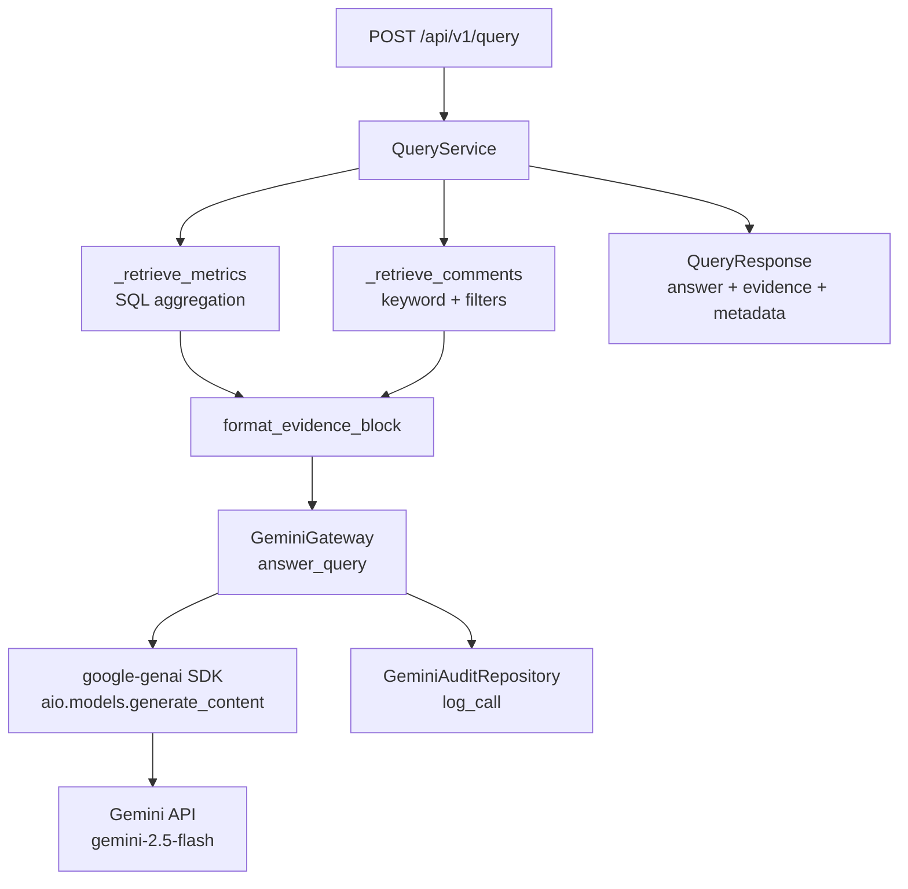

# Integración con Gemini API

> Arquitectura, pipeline RAG, prompt engineering y auditoría.
> Última actualización: 2026-04-08

---

## Visión General

El sistema utiliza Google Gemini API **exclusivamente** para consultas semánticas sobre los datos ya estructurados. No se usa IA para extracción de PDF ni clasificación base (ver [ADR-005](adr/005-parser-deterministico-pdf.md) y [ADR-006](adr/006-gemini-solo-analisis-cualitativo.md)).

```
Usuario → Pregunta → QueryService → RAG retrieval → GeminiGateway → Respuesta + evidencia
                                          ↓                              ↓
                                     PostgreSQL                    GeminiAuditLog
```

---

## Arquitectura de Componentes



### Capas

| Capa           | Componente              | Archivo                                       | Responsabilidad                       |
| -------------- | ----------------------- | --------------------------------------------- | ------------------------------------- |
| API            | `query.router`          | `api/v1/query.py`                             | Validación HTTP, dependency injection |
| Application    | `QueryService`          | `application/services/query_service.py`       | Orquestación RAG completa             |
| Infrastructure | `GeminiGateway`         | `infrastructure/external/gemini_gateway.py`   | Wrapper tipado sobre google-genai SDK |
| Infrastructure | `prompt_templates`      | `infrastructure/external/prompt_templates.py` | Prompts del sistema y templates       |
| Infrastructure | `GeminiAuditRepository` | `infrastructure/repositories/gemini_audit.py` | Persistencia de logs de auditoría     |

---

## Configuración

### API Key

```bash
# backend/.env
GEMINI_API_KEY=AIzaSy...tu-clave-real
```

Obtener en: https://aistudio.google.com/apikey

Si la clave no está configurada, el gateway lanza `GeminiUnavailableError` y el endpoint retorna HTTP 503.

### Modelo

```python
_DEFAULT_MODEL = "gemini-2.5-flash"  # en gemini_gateway.py
_DEFAULT_TIMEOUT_MS = 30_000         # 30 segundos
```

### Parámetros de Generación

```python
config = types.GenerateContentConfig(
    system_instruction=QUERY_SYSTEM_PROMPT,
    temperature=0.3,          # Respuestas consistentes
    max_output_tokens=1024,   # Límite de respuesta
)
```

---

## Pipeline RAG (Retrieval-Augmented Generation)

### Paso 1: Recuperar Métricas

`QueryService._retrieve_metrics()` ejecuta queries SQL:

- **Promedio general** o filtrado por docente/periodo
- **Promedios por dimensión** (METODOLOGÍA, Dominio, etc.) si hay filtros

Máximo: `_MAX_METRICS = 10` resultados.

### Paso 2: Recuperar Comentarios

`QueryService._retrieve_comments()`:

1. Filtra por estado `completado`
2. Aplica filtros opcionales: `periodo`, `docente`, `asignatura`
3. **Detección de tema**: `_detect_tema()` busca keywords en la pregunta del usuario para filtrar comentarios por tema relevante
4. Ordena por `created_at DESC`, límite `_MAX_COMMENTS = 20`

### Paso 3: Construir Prompt

```python
# Formato del contexto
evidence_block = format_evidence_block(comments, metrics)

# Template del usuario
prompt = QUERY_USER_TEMPLATE.format(
    question=user_question,
    evidence_block=evidence_block,
)
```

El `evidence_block` contiene:

- Métricas numeradas como `[M1]`, `[M2]`, etc.
- Comentarios numerados como `[C1]`, `[C2]`, etc.

### Paso 4: Llamar a Gemini

```python
response = await self._client.aio.models.generate_content(
    model=self._model,
    contents=user_prompt,
    config=config,
)
```

### Paso 5: Auditar y Responder

- Se registra en `gemini_audit_log` (prompt, respuesta, tokens, latencia, status)
- Se construye `QueryResponse` con answer, evidence y metadata

---

## Prompt Engineering

### System Prompt

El `QUERY_SYSTEM_PROMPT` establece el rol del modelo:

- Asistente experto en evaluaciones docentes universitarias
- Responde solo con base en la evidencia proporcionada
- Cita fuentes usando notación `[N]` (ej: `[1]`, `[M2]`)
- Si la evidencia es insuficiente, lo indica explícitamente

### User Template

```
Pregunta del usuario: {question}

Evidencia disponible:
{evidence_block}

Responde la pregunta usando SOLO la evidencia anterior. Cita las fuentes relevantes.
```

### Sistema de Citación

Las respuestas del modelo usan notación `[N]` para referenciar la evidencia:

- `[1]`, `[2]` → referencias a métricas o comentarios específicos
- El frontend mapea estas referencias a los objetos `evidence` de la respuesta

---

## Manejo de Errores

### Jerarquía de Excepciones

```
GeminiError (base)
├── GeminiRateLimitError   → HTTP 429 (retry hint)
├── GeminiTimeoutError     → HTTP 504
└── GeminiUnavailableError → HTTP 503 (sin API key)
```

### Mapping en el Gateway

| Excepción SDK              | Excepción Dominio      | Condición                    |
| -------------------------- | ---------------------- | ---------------------------- |
| `genai_errors.ClientError` | `GeminiRateLimitError` | `429` o `rate` en el mensaje |
| `genai_errors.ClientError` | `GeminiError`          | Otros errores de cliente     |
| `genai_errors.ServerError` | `GeminiError`          | Errores del servidor Gemini  |
| `TimeoutError`             | `GeminiTimeoutError`   | Timeout de red               |
| `Exception`                | `GeminiError`          | Cualquier error inesperado   |

### Retry con Backoff Exponencial

El `GeminiGateway` incluye reintentos automáticos para errores transitorios:

| Parámetro           | Valor por defecto | Descripción                    |
| ------------------- | ----------------- | ------------------------------ |
| `_MAX_RETRIES`      | `3`               | Número máximo de reintentos    |
| `_RETRY_BASE_DELAY` | `1.0` s           | Delay base entre reintentos    |
| `_RETRY_MAX_DELAY`  | `16.0` s          | Delay máximo (cap del backoff) |

**Excepciones retriables:** `genai_errors.ServerError`, `TimeoutError`.
**Excepciones NO retriables:** `genai_errors.ClientError` y cualquier otro error se propagan inmediatamente.

Cada reintento aplica backoff exponencial: `delay = min(base × 2^attempt, max_delay)`.

### Auditoría de Errores

Las llamadas fallidas **también** se registran en `gemini_audit_log` con `status = 'error'` y `error_detail` antes de re-lanzar la excepción.

---

## Auditoría (gemini_audit_log)

Cada llamada a Gemini se registra:

| Campo           | Descripción                                               |
| --------------- | --------------------------------------------------------- |
| `operation`     | `"query"` (expandible a `"classify"`, `"summarize"`)      |
| `prompt_text`   | Prompt completo enviado                                   |
| `prompt_hash`   | SHA-256 del prompt (detección de duplicados/cache futuro) |
| `response_text` | Respuesta del modelo                                      |
| `model_name`    | `"gemini-2.5-flash"`                                      |
| `tokens_input`  | Tokens de entrada consumidos                              |
| `tokens_output` | Tokens de salida generados                                |
| `latency_ms`    | Tiempo de respuesta en milisegundos                       |
| `status`        | `"ok"` o `"error"`                                        |
| `error_detail`  | Detalle si falló                                          |

---

## Detección de Tema (Keyword-based)

El `QueryService._detect_tema()` analiza la pregunta del usuario para filtrar comentarios relevantes:

```python
tema_keywords = {
    "metodologia": ["metodolog", "método", "dinám", "didáctic"],
    "comunicacion": ["comunic", "explic", "clar", "interac"],
    "evaluacion": ["evalua", "examen", "nota", "califica"],
    "puntualidad": ["puntual", "hora", "tarde", "asisten"],
    "material": ["material", "presentaci", "recurso", "diapositiva"],
    "actitud": ["actitud", "amable", "respetuos", "motiv", "trato"],
    "dominio_tema": ["dominio", "conocimiento", "experto", "sabe"],
    "organizacion": ["organiz", "estructur", "planific"],
    "tecnologia": ["virtual", "tecnolog", "plataforma", "herramienta"],
}
```

---

## Testing

### FakeGeminiGateway

Para tests, se inyecta un fake que cumple el `GeminiGatewayProtocol`:

```python
class FakeGeminiGateway:
    """Retorna respuestas enlatadas sin llamar a Gemini."""
    async def answer_query(self, question, comments, metrics):
        return GeminiCallResult(
            text="Respuesta de prueba",
            model_name="fake-model",
            tokens_input=10,
            tokens_output=20,
            latency_ms=50,
        )
```

### Tests unitarios

- Gateway: verificar mapping de excepciones, construcción de prompts
- QueryService: verificar RAG pipeline con DB mock y fake gateway
- Prompt templates: verificar formato de evidence blocks

### Tests de API

- `POST /api/v1/query` con fake gateway inyectado
- Verificar respuesta con answer, evidence, metadata
- Verificar error 503 cuando no hay API key
- Verificar error 422 para requests inválidos

---

## Seguridad

| Medida              | Detalle                                                         |
| ------------------- | --------------------------------------------------------------- |
| Solo texto a Gemini | Nunca se envía el PDF binario — solo texto extraído y métricas  |
| API key en env      | No se versiona en el repositorio, cargada desde `backend/.env`  |
| Auditoría completa  | Cada llamada queda registrada con prompt, respuesta y métricas  |
| Prompt hash         | SHA-256 del prompt para trazabilidad y detección de duplicados  |
| Rate limiting       | Excepciones específicas para 429, con retry en capas superiores |

---

## Roadmap Futuro

| Fase       | Mejora                                                          |
| ---------- | --------------------------------------------------------------- |
| **Fase 2** | Búsqueda semántica con pgvector (embeddings de comentarios)     |
| **Fase 2** | Clasificación de sentimiento por IA (reemplazar reglas keyword) |
| **Fase 3** | Cache de respuestas por `prompt_hash`                           |
| **Fase 3** | Streaming de respuestas (Server-Sent Events)                    |
| **Fase 3** | Resúmenes automáticos por evaluación                            |
