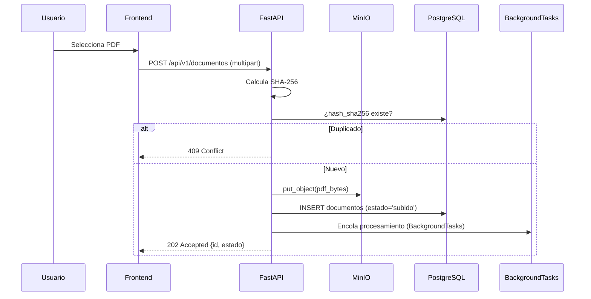
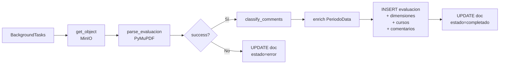

# Flujo de Procesamiento Documental

> Del PDF crudo a datos estructurados y clasificados.
> Última actualización: 2026-06-04

---

## Visión General

El procesamiento transforma un archivo PDF de evaluación docente CENFOTEC en datos relacionales listos para consulta y análisis. El pipeline es **determinístico** (sin IA) para la extracción y clasificación base, reservando Gemini únicamente para consultas semánticas posteriores.

```
PDF → Upload → MinIO → Parser → Extracción → Clasificación → PostgreSQL
                                   ↓                ↓
                               4 extractores    keywords/reglas
```

---

## 1. Fase de Carga (Upload)



**Decisiones clave:**

- El PDF se almacena en MinIO **antes** de encolar — si el procesamiento falla, el archivo no se pierde.
- Hash SHA-256 evita procesamiento duplicado.
- Respuesta `202 Accepted` inmediata — el procesamiento es asíncrono.

---

## 2. Fase de Parseo (Parser Determinístico)

El parser (`app.application.parsing`) es una función pura que recibe bytes de PDF y devuelve un `ParseResult` tipado. **Nunca lanza excepciones** — los errores se acumulan en listas estructuradas.

### Arquitectura del Parser

```
parse_evaluacion(pdf_bytes)
    │
    ├── open_pdf(fitz.open)
    │
    ├── extract_header(page_1_text)        → HeaderData
    │   └── Regex: PERIODO_RE, PROFESOR_RE, RECINTO_RE
    │
    ├── extract_metrics(page_1_tables)     → [DimensionMetrica], ResumenPorcentajes
    │   └── Identifica tabla por KNOWN_DIMENSIONS
    │
    ├── extract_courses(all_tables)        → [CursoGrupo], totales
    │   └── Identifica tabla por "Código" en header row
    │
    ├── extract_comments(pages_text, tables_by_page)  → [SeccionComentarios]
    │   └── Identifica secciones por COMMENT_SECTION_RE
    │
    └── Return ParseResult(success=True, data=ParsedEvaluacion)
```

### Extractores

#### 2.1 Header Extractor

Extrae del texto crudo de la página 1:

| Campo             | Regex                 | Ejemplo match           |
| ----------------- | --------------------- | ----------------------- |
| `profesor_nombre` | `PROFESOR_RE`         | `"Juan Pérez (ABC123)"` |
| `profesor_codigo` | `PROFESOR_RE` grupo 2 | `"ABC123"`              |
| `periodo`         | `PERIODO_RE`          | `"I Cuatrimestre 2025"` |
| `recinto`         | `RECINTO_RE`          | `"San José"`            |

Si algún campo requerido no se encuentra, el parser retorna error fatal.

#### 2.2 Metrics Extractor

Opera sobre tablas extraídas con `page.find_tables()` de PyMuPDF:

- Identifica la tabla de dimensiones por la presencia de `KNOWN_DIMENSIONS` (`METODOLOGÍA`, `Dominio`, `CUMPLIMIENTO`, `ESTRATEGIA`, `GENERAL`).
- Cada fila de dimensión tiene 9 columnas: `[nombre, est_pts, est_%, dir_pts, dir_%, auto_pts, auto_%, prom_pts, prom_%]`.
- Los puntos tienen formato `"18.61 / 20.00"` (patrón `PUNTOS_RE`).
- La última fila (sin nombre de dimensión) se interpreta como resumen de porcentajes.

**Salida:** `list[DimensionMetrica]` + `ResumenPorcentajes`

#### 2.3 Courses Extractor

Extrae filas de la tabla de cursos:

- Identificación: primera celda del header contiene `"Código"`.
- La escuela se detecta buscando hacia arriba por filas con `"ESC "`.
- Estudiantes: formato `"13 / 15"` (respondieron / matriculados) con `TOTAL_ESTUDIANTES_RE`.
- Códigos de curso: contienen guión (`"-"`) y ≤ 20 caracteres.

**Salida:** `list[CursoGrupo]`, `total_respondieron`, `total_matriculados`

#### 2.4 Comments Extractor

Extrae comentarios cualitativos de las secciones de fortalezas/mejoras/observaciones:

- **Sección anchor:** `Evaluación Estudiante Profesor -- Fundamentos de Bases de Datos` (regex `COMMENT_SECTION_RE`)
- **Tabla de comentarios:** identificada por headers `Fortalezas | Mejoras | Observaciones`
- **Layout clásico:** anchor en texto, tabla debajo
- **Layout wrapped:** anchor embebido dentro de la tabla misma
- **Filtrado de ruido:** Se excluyen valores como `"."`, `"n/a"`, `"sin comentarios"` (conjunto `NOISE_VALUES`)
- **Merge cross-page:** Secciones con mismo `(tipo, asignatura)` divididas entre páginas se fusionan

**Salida:** `list[SeccionComentarios]`, cada una con `tipo_evaluacion`, `asignatura`, y `list[Comentario]`

### Esquemas del Parser

```python
ParsedEvaluacion
├── header: HeaderData (profesor, periodo, recinto)
├── dimensiones: list[DimensionMetrica] (puntajes pedagógicos)
├── resumen_pct: ResumenPorcentajes (4 porcentajes globales)
├── cursos: list[CursoGrupo] (curso-grupo evaluados)
├── total_respondieron: int
├── total_matriculados: int
└── secciones_comentarios: list[SeccionComentarios]
    └── comentarios: list[Comentario] (fortaleza, mejora, observacion)
```

### Manejo de Errores del Parser

El parser **nunca lanza excepciones**. Retorna un `ParseResult`:

```python
@dataclass
class ParseResult:
    success: bool
    data: ParsedEvaluacion | None
    errors: list[ParseError]      # Fatales — stage, code, message, context
    warnings: list[ParseWarning]  # No fatales — datos usables con anomalías
    metadata: ParseMetadata       # Diagnóstico: versión, páginas, tablas encontradas
```

| Stage         | Descripción                               |
| ------------- | ----------------------------------------- |
| `open`        | No se puede abrir el PDF                  |
| `header`      | Faltan campos de encabezado               |
| `metricas`    | No se encontró tabla de dimensiones       |
| `cursos`      | No se encontró tabla de cursos            |
| `comentarios` | Error procesando secciones de comentarios |
| `validation`  | Validación Pydantic final falló           |

---

## 3. Fase de Clasificación

Después del parseo, cada comentario extraído pasa por el clasificador determinístico (`app.application.classification`).

### 3.1 Clasificación por Tema

Matching por keywords/stems contra 9 temas predefinidos:

| Tema           | Keywords (muestra)                            |
| -------------- | --------------------------------------------- |
| `metodologia`  | dinám, método, didáctic, taller, práctic      |
| `dominio_tema` | dominio, conocimiento, experto, sabe          |
| `comunicacion` | explic, clar, comunic, interac, escucha       |
| `evaluacion`   | nota, examen, evalua, rúbrica, califica       |
| `puntualidad`  | puntual, hora, tarde, falt, responsab         |
| `material`     | material, presentaci, recurso, diapositiva    |
| `actitud`      | amable, respetuos, motiv, trato, empat        |
| `tecnologia`   | virtual, zoom, teams, herramienta, plataforma |
| `organizacion` | organiz, estructur, planific, syllabus        |
| `otro`         | (fallback si ningún keyword coincide)         |

Los patterns se pre-compilan con `re.compile()` y se evalúan en orden — **first match wins**.

### 3.2 Clasificación por Sentimiento

Reglas basadas en keywords con prior por tipo de comentario:

```
score = (positivos - negativos) / total
```

| Condición                    | Label      |
| ---------------------------- | ---------- |
| `score > 0.25`               | `positivo` |
| `score < -0.25`              | `negativo` |
| ambos > 0 y score intermedio | `mixto`    |
| sin keywords                 | `neutro`   |

**Prior por tipo:**

- `fortaleza` → `+1` a positivos
- `mejora` → `+1` a negativos
- `observacion` → sin prior

### 3.3 Función de entrada

```python
classify_comment(texto: str, tipo: str) -> ClassificationResult
# Retorna: {tema, tema_confianza, sentimiento, sent_score}
```

---

## 4. Fase de Enriquecimiento (PeriodoData)

Antes de persistir, el parser enriquece la evaluación con datos derivados del período:

```python
PeriodoData = {
    "modalidad": "CUATRIMESTRAL" | "MENSUAL" | "B2B" | "DESCONOCIDA",
    "año": 2025,
    "periodo_orden": 1  # Orden dentro del año [BR-AN-40]
}
```

La detección de modalidad se basa en regex sobre el código del período (`periodo.py`):

- `^B2B[\s\-].+` → `B2B` (evaluado primero por prioridad)
- `^C([1-3])\s+(\d{4})$` → `CUATRIMESTRAL` (C1–C3)
- `^(MT?)(\d{1,2})\s+(\d{4})$` → `MENSUAL` (M1–M10, MT1–MT10)
- No match → `DESCONOCIDA`

Estos campos habilitan el filtro por modalidad [BR-MOD-02] en toda la plataforma.

---

## 5. Fase de Persistencia

Los datos parseados, clasificados y enriquecidos se insertan en PostgreSQL:

```
ParsedEvaluacion + PeriodoData
    → evaluaciones (1 fila, con modalidad, año, periodo_orden)
    → evaluacion_dimensiones (N filas)
    → evaluacion_cursos (N filas)
    → comentario_analisis (N filas, con tema + sentimiento)
    → document_processing_jobs (1 fila, estado + métricas del job)
    → documentos.estado = "completado"
```

Todo ocurre en una transacción — si falla cualquier paso, se hace rollback completo y `documentos.estado = "error"`.

---

## 6. Pipeline asíncrono (BackgroundTasks)

El procesamiento se ejecuta dentro del proceso de FastAPI usando `BackgroundTasks`:



El procesamiento es síncrono dentro del background task. Los fallos de parseo (PDF mal formado) marcan `estado = 'error'` sin reintentos.

---

## 6. Versión del Parser

```python
PARSER_VERSION = "1.0.0"  # en constants.py
```

Se registra en `ParseMetadata.parser_version` para trazabilidad. Si el parser cambia, se puede re-procesar selectivamente PDFs procesados con versiones anteriores.
